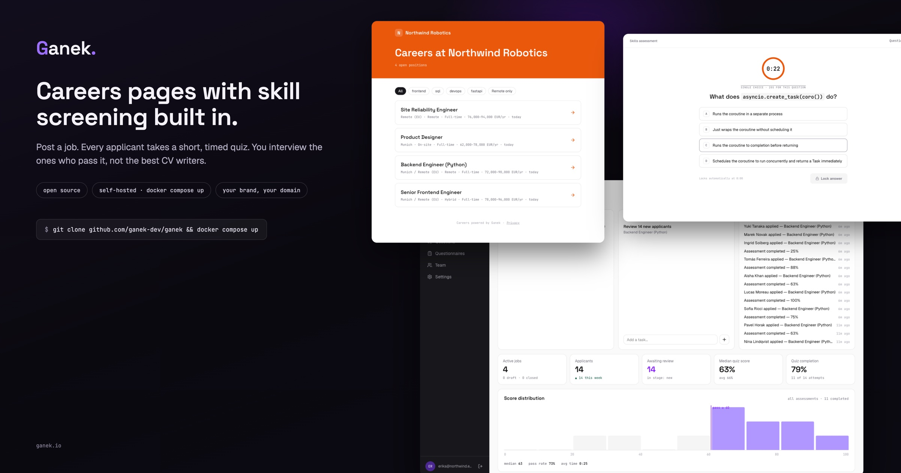

# Ganek

**Open-source careers pages with built-in skill screening.**



Ganek gives any company a branded careers page, job posting management, and applicant tracking — plus an optional twist: after a candidate submits their CV, Ganek can serve a short, timed multiple-choice quiz matched to the job's skill tags (Python job → python/asyncio/fastapi questions, ~15 seconds each). Recruiters see applications ranked with real signal instead of just a pile of PDFs.

> ⚠️ **Status: pre-alpha.** Under active development, not yet usable. Watch/star to follow along.

## Why

- No good open-source alternative to hosted careers pages / ATS-lite tools exists.
- Engineering roles drown in low-signal applications; a 2-minute knowledge screen is a fair, fast first filter.
- Your hiring data should be able to live on your infrastructure.

## Features (v1 target)

- 🏢 Branded careers page (theme tokens, logo, custom slug) with SEO-friendly SSR and Google Jobs structured data
- 📋 Job posting management with markdown descriptions and tags
- 📥 Application intake with CV upload
- ⏱️ Tag-matched screening quizzes: open question bank + your own private questions, per-job configuration, server-side timing and scoring, cheat-resistant by design
- 📊 ATS-lite: pipeline stages, quiz scores with per-tag breakdown, integrity flags, notes
- 🛡️ GDPR-ready: per-company privacy notices, retention automation, erasure & DSAR tooling, no cookies or trackers on candidate pages — plus a [compliance pack](docs/compliance/README.md) with DPIA and records templates
- 🐳 Self-host with one `docker compose up` — or use the hosted version at ganek.dev (coming later)
- 🧩 Domain-agnostic engine: engineering first, any field via community question packs

## Quiz integrity, in short

Everything that matters is server-authoritative: questions are served one at a time, timing and scoring happen server-side, correct answers never reach the client, pools are large and randomized, options are shuffled per attempt. Focus-loss and paste telemetry is surfaced to recruiters as flags — Ganek never auto-rejects anyone.

## GDPR & privacy

Candidate pages set zero cookies and load no third-party anything — there is nothing to consent-banner. Transparency notices, erasure, data-export (DSAR), and an automatic retention purge are built in, telemetry is disclosed before it happens, and scoring is deterministic rules, not ML (see the [AI Act statement](docs/compliance/ai-act-statement.md)).

The company deploying Ganek is the data controller for its candidates. Ganek ships **GDPR-ready** — the tooling plus a [compliance pack](docs/compliance/README.md) with a self-hosting controller guide, a pre-filled DPIA, an Art. 30 records template, and a breach runbook. Compliance itself is a property of your deployment and how you operate it, which is why the pack exists.

## Quickstart (self-host)

```bash
git clone https://github.com/vetd-dev/vetd && cd vetd
cp .env.example .env        # edit as needed
docker compose up
# open http://localhost:3000 and follow the setup wizard
```

Ganek expects a **database of its own**. The bundled compose stack provides one
(isolated volume, port not published). If you point Ganek at an existing
postgres server instead, create a dedicated database for it and set
`VETD_DATABASE_URL` accordingly — don't share a database with another
application.

## Contributing

Code and question-pack contributions welcome — see [CONTRIBUTING.md](CONTRIBUTING.md). The question bank especially benefits from many eyes: [questions/README.md](questions/README.md).

## License

[AGPL-3.0](LICENSE). You can self-host Ganek freely, including commercially, for your own hiring. If you offer Ganek as a service to others, the AGPL requires you to share your modifications.
